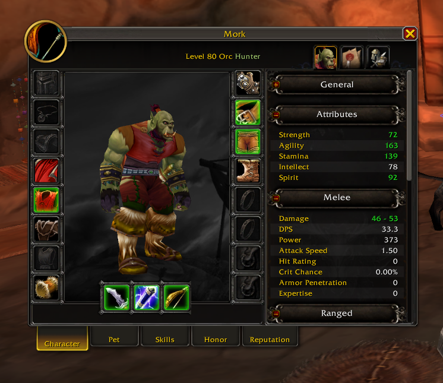
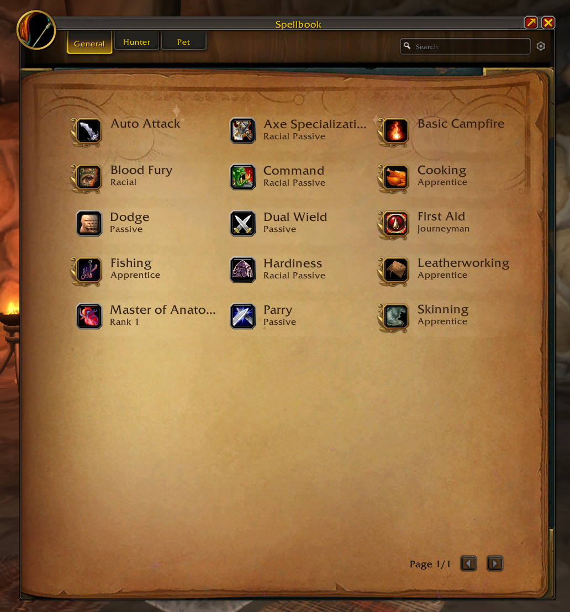
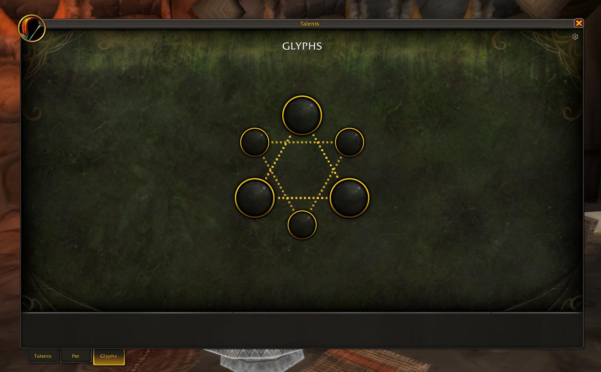
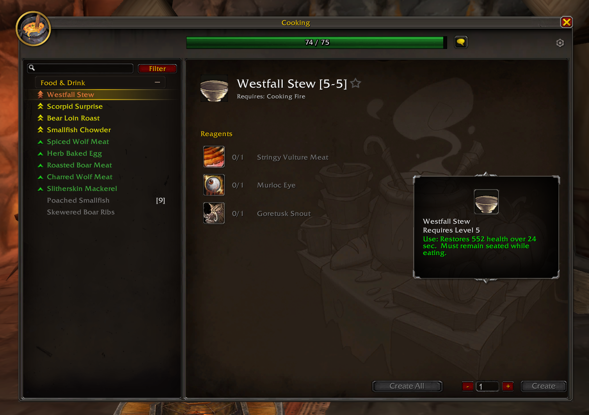
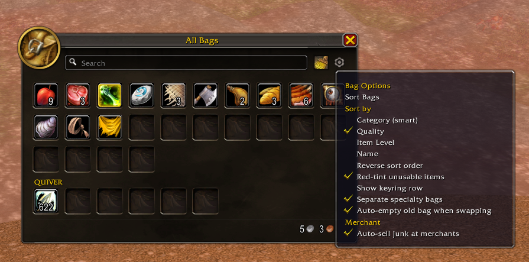
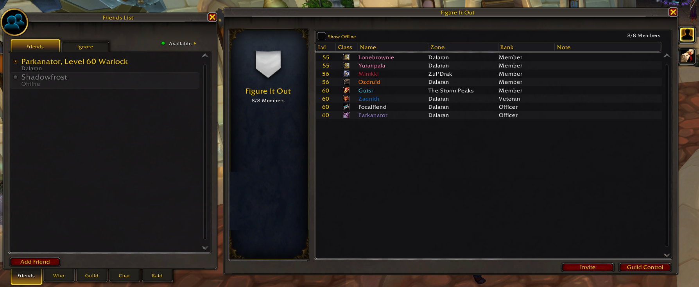

# DragonUI_NewEra

A support / extension module for **[DragonUI](https://github.com/NeticSoul/DragonUI)** — the World of Warcraft **3.3.5a (WotLK)** port of the Dragonflight UI.

DragonUI ports the Dragonflight **HUD** to 3.3.5a. **DragonUI_NewEra** fills in the rest: it faithfully downports the panel work from **NewEra** (Ashgaroth's Classic Era 1.15 Dragonflight-style addon) to 3.3.5a, rebuilding the panels DragonUI hasn't ported yet so the whole interface matches the modern look — not just the action bars.

> **Requires DragonUI and ClassicAPI.** This is an add-on *to* DragonUI, not a standalone UI — it reuses DragonUI's textures, atlases, and chrome where possible and only rebuilds what's missing. It also depends on **`!!!ClassicAPI`**, a compatibility layer that backports the modern API (`C_Timer`, `C_Texture`, `C_Container`, `C_Spell`, `C_Map`, `Mixin`, …) onto the 3.3.5a client; the panels are built against those modern globals. Both are hard dependencies (declared in the `.toc`) and must be installed and enabled.

## What's inside

### Character panel



A full custom replacement for the 3.3.5a `CharacterFrame`, styled to match Dragonflight:

- Paperdoll (3D model + all equipment slots) with modern model controls (zoom, click-drag rotate / pan)
- **Stats sidebar** (General / Attributes / Melee / Ranged / Spell / Defense / Resistances) with proper tooltips - compatible with [EnhancedCharStats](https://github.com/thezephyrsong/EnhancedCharStats/)
- Tabs for **Character, Pet, Skills, Honor, Reputation**
- **Titles** picker — set your title from the panel; the window header shows `Name <Title>`
- **Equipment Manager** — a fully client-side gear-set manager (works on any server, no reliance on the native equipment-manager API)

### `/gearset` — equip a saved set by name

Save gear sets in the Equipment Manager, then swap to one from chat or a macro:

```
/gearset "Tank Set"      -- equip the set named "Tank Set" (case-insensitive)
/dnequip "Healer Set"    -- alias of /gearset
```

- Matches by name (quoted or bare); errors and lists your sets if no match.
- If the set is already fully equipped, it does nothing (no redundant request to the server).
- Sets are stored client-side in SavedVariables and applied with a physical item swap.

*(Note: `/equip` and `/equipset` are reserved built-in WotLK macro commands, hence `/gearset` / `/dnequip`.)*

### Spellbook



A standalone War-Within-style two-page spellbook, replacing the 3.3.5a `SpellBookFrame`:

- **Card layout** — every learned spell as a Dragonflight-style card (icon + name + rank), flowing across a two-page evergreen book; a min/max button collapses it to a single page (↗ Expand / ↙ Condense).
- **Category tabs** — General, your class (sectioned by spec), and a live Pet tab, styled to match the Character panel.
- **Active vs passive** — active spells use the gold spellbook frame; passives use the dark square talent-node socket. Passive cells are click-inert (hover for tooltip only); pet cells ignore right-click.
- **Whole-cell interaction** — click anywhere on a cell to cast, drag to place it on a bar, hover anywhere for the tooltip.
- **Search + options** — filter spells by name; a cog menu toggles *Hide Passives* and *Show All Ranks* (off = highest rank only).

Built natively for 3.3.5a's index-based spellbook API (a compat shim maps the Cataclysm `GetSpellBookItem*` family onto it).

### Talents


A standalone War-Within-style talent window over WotLK's classic grid talents, opened with **`/netalents`** or the default talent key:

- **Three trees** on the Dragonflight metal chrome, with real talent data, per-tree point readouts, and a live **preview → Apply / Reset** flow — left-click to spend, right-click to refund, nothing is permanent until you Apply (behind a confirm).
- **Retail-style nodes** — square / circle / capstone art derived per talent, with a hover highlight, a gold flash when a rank lands, and a subtle random glint that wanders across the talents you've spent points in.
- **Per-tier centering** — rows with fewer than four talents are packed and centred (the way retail lays them out), and the three trees are centred in the window.
- **Spec-art backgrounds** — each class/spec paints its own artwork behind the trees.
- **Animated connectors** — prerequisite links draw as a flowing dotted line straight from one talent to the talent that needs it.
- **Multi-spec** — bottom tabs switch between up to 4 specs depending on server configurations; rename the specs from the cog (custom names persist per character). View your other spec read-only (dimmed) and hit **Activate** to switch to it.
- **Pet talents** — hunters with a talented pet out get a **Pet** tab (Ferocity / Tenacity / Cunning) on the pet's own family artwork, with the same live preview → Apply / Reset flow, the pet's circular portrait, the correct 3-points-per-tier gating, and the single tree centred in the window.
- Sound cues for spending, refunding, applying, and switching specs.

Built natively for 3.3.5a's talent + preview-talent API (`GetTalentInfo`, `AddPreviewTalentPoints`, `LearnPreviewTalents`, dual `GetActiveTalentGroup`, and their `isPet` variants).

### Glyphs



The **Glyphs** tab shares the talent window — a hexagon of major/minor glyph sockets you socket, swap, and clear directly (the stock glyph frame is suppressed):

- **Class artwork** — each class gets its own full-window Legion-artifact-style backdrop behind the sockets.
- **One title, per-spec labels** — a single **GLYPHS** header; under dual spec each spec's name (**PRIMARY** / **SECONDARY**, or your custom rename, in caps) is lined up above its own socket cluster instead of repeating the title.
- **Animated links** — the same flowing dotted connectors as the talent trees tie the sockets together.
- ***Optional*** - see a list of the effects of each glyphs next to the glyphs

### Professions



A standalone Dragonflight-style profession window replacing the 3.3.5a `TradeSkillFrame`, with a modern recipe list, item/reagent details, a generic skill bar, and cog options — plus optional **Auctionator** integration via an AH scan button.

### Auction House


A standalone Dragonflight-style Auction House window replacing the 3.3.5a `AuctionFrame`:

- **Buy** — search the market; results aggregate by item, drilling into a per-item detail page for bid/buyout.
- **Sell** — drag an item into the sell slot, set quantity/price/duration against a live view of that item's current market listings, and post.
- **Auctions** — Auctions/Bids sub-tabs with a retail-style summary of your listings grouped by item, plus the full owner/bidder list and Cancel Auction.
- **Auctionator reskin** — when Auctionator is installed, its Buy/Sell/More panel is reparented straight into this window and fully restyled to match (dark fill, gold-trim insets, zebra-striped rows, reskinned scrollbars/tabs/dialogs) instead of popping open its own separate parchment-style frame. Its tabs sit alongside the shell's own Buy/Sell/Auctions tabs and drive the same window.

### Bags — *work in progress*



A retail-style **combined bag** plus a per-window restyle for the **individual** Blizzard bag frames, both sharing the same metal chrome, recessed slots, portrait treatment, and item cues as the rest of the addon. **This one is still being built and polished — expect rough edges.**

- **Combined window** (default) — every backpack/bag slot in one movable Dragonflight-style grid, with a search box, a smart sort, and a bottom band showing your money + watched currencies. It takes over bag opening; a toggle in the NewEra options turns it off (→ stock Blizzard bags, needs `/reload`).
- **Individual bags** — a lighter restyle that skins the stock per-window bags in place (metal frame, portrait, recessed slots, rarity/usable cues) for players who prefer separate windows. Superseded by the combined window by default.
- **Smart sort** — consolidates partial stacks, routes specialty items into their bags (arrows → quiver, bullets → ammo pouch, herbs → herb bag, soul shards → soul bag, profession mats → their bags), then arranges by category → subtype → quality, with the Hearthstone pinned first and same-item stacks ordered fullest-first. The sort runs behind a "Sorting…" cover and keeps going until the layout settles rather than for a fixed number of passes.
- **Separate specialty bags** *(optional toggle)* — split quivers, ammo pouches, soul bags, and profession bags out of the general grid into their own labeled sections below it (**QUIVER**, **MINING BAG**, **HERB BAG**, …), mirroring the keyring row.
- **Keyring row** *(optional)* — show your keys as a **KEYS** row inside the window.
- **At-a-glance cues** — item-rarity glow, a red tint on anything you can't use (missing weapon/armor proficiency, too low a level, or a recipe whose profession/skill you don't have), the merchant "sell" cursor, a quest-item glow, and optional auto-sell-junk at vendors.

### Social & Guild



Standalone Dragonflight-style windows replacing the 3.3.5a `GuildFrame` and `FriendsFrame`:

**Guild** — a **Communities**-look window scoped to what 3.3.5a actually serves (no Benefits/Rewards, ClubFinder, or calendar — those are Cata+ systems):

- **Roster** — sortable member list (Level / Class icon / Name / Zone / Rank / Note) with a guild-tabard badge, member detail, and the full permission-gated action set: public/officer notes, promote/demote/remove, and party invite.
- **Guild Info** — the Message of the Day and Guild Information text wells, editable in place when you have the right, shown side by side with Guild Chat.
- **Guild Chat, with history sync** — regular guild and officer chat rendered in the modern chrome, with **class-colored names** (live and backlog). Since 3.3.5a keeps no server-side chat log, a rolling per-guild history is saved locally and, on login, synced from other online guildmates over an addon message so a fresh `/reload` doesn't show an empty window — deduplicated and correctly ordered even across guildmates' differing system clocks. History is shared across all characters on your account in the same guild.

**Social** — built on the classic friends/ignore/who/channels/raid APIs:

- **Friends** — two-line entries (status icon + name/level/class over zone) with Friends and Ignore sub-tabs.
- **Who** — the stock Name / Zone / Lvl / Class columns, with a switchable second column (zone/guild/race) and full filter support.
- **Guild** — opens the standalone Guild window above rather than hosting a duplicate view inline.
- **Chat** — the chat-channels tab: a grouped channel list (Group / World / Custom headers) on the left, a live roster for the selected channel on the right, and an Add-channel button.
- **Raid** — a native raid roster grid with convert-to-raid and a full right-click context menu (promote, demote, assign main tank/assist, remove), permission-gated the same as stock.

## Roadmap

Faithfully downporting the remaining NewEra panels to 3.3.5a:

- [x] ~~**Character panel**~~ — *done* (paperdoll, stats sidebar, Skills / Honor / Reputation / Pet tabs, Titles, Equipment Manager + `/gearset`)
- [x] ~~**Spellbook**~~ — *done* (two-page book, category tabs, active/passive frames, search + Hide Passives / Show All Ranks, single/double-page toggle)
- [x] ~~**Talents**~~ — *done* (3-tree panel, live preview/Apply/Reset, retail-style nodes, per-tier centering, spec-art backgrounds, animated connectors, dual-spec tabs with custom names, hunter **pet talents** tab, and a **glyphs** page with per-class artwork)
- [x] ~~**Professions**~~ — *done* (Main profession Window, extra integration with Auctionator via AH Scan Button)
- [x] ~~**Auction House**~~ — *done* (Buy/Sell/Auctions panel, plus a full Auctionator embed + reskin when it's installed)
- [x] ~~**Guild**~~ — *done* (Roster with member actions, Guild Info, Guild Chat with class-colored names + cross-session/cross-character history sync)
- [x] ~~**Social**~~ — *done* (Friends + Ignore, Who, Chat channels, Raid roster; Guild tab opens the standalone Guild window)
- [ ] **Bags** — *work in progress* (retail combined bag + individual-bag restyle: grid, smart sort, separated specialty-bag sections, keyring row, rarity/usable cues, money + currency band)
- [ ] **Quest Log**
- [ ] **Merchant**
- [ ] **Mail**

## Credits

- **[DragonUI](https://github.com/NeticSoul/DragonUI)** by NeticSoul — the base 3.3.5a Dragonflight UI port this builds on.
- **NewEra** by Ashgaroth — the Classic Era Dragonflight-style addon these panels are downported from.
- Dragonflight UI © Blizzard Entertainment.
